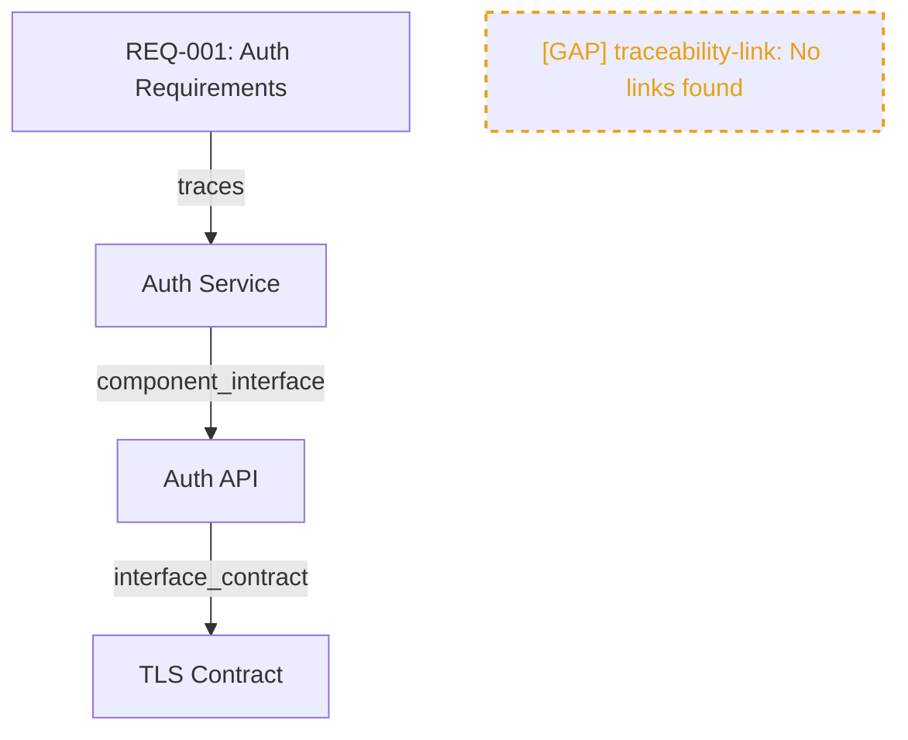

# Phase 8: Diagram Generation Core - Research

**Researched:** 2026-03-07
**Domain:** D2 / Mermaid diagram source generation from view handoff data
**Confidence:** HIGH

## Summary

Phase 8 introduces a diagram generation engine that consumes the view handoff format (output of `assemble_view()`) and produces syntactically valid D2 source for structural diagrams and Mermaid source for behavioral diagrams. The generator writes diagram slots through SlotAPI using content-hash IDs, renders gap markers as visually distinct dashed/colored placeholders, and preserves all non-diagram slots during execution.

The existing codebase provides strong foundations: the view handoff format is well-defined (sections, edges, gaps arrays), SlotAPI supports typed CRUD with schema validation, and the script+command pattern is established. The primary new work is the D2/Mermaid generation engines, a new `diagram` slot type with schema, and the `diagram_hint` field on view specs.

**Primary recommendation:** Build `diagram_generator.py` with two pure-function backends (`generate_d2` and `generate_mermaid`) that accept a view dict and return diagram source strings. Keep rendering logic stateless and side-effect-free; slot writes happen in a thin orchestration layer.

<user_constraints>

## User Constraints (from CONTEXT.md)

### Locked Decisions
- **Spec-driven mapping**: view specs declare a `diagram_hint` field (`"structural"` or `"behavioral"`). Structural produces D2, behavioral produces Mermaid
- Built-in spec defaults: `system-overview` -> structural (D2), `traceability-chain` -> behavioral (Mermaid), `component-detail` -> structural (D2), `interface-map` -> structural (D2), `gap-report` -> no diagram hint
- D2 structural: components as **nested containers** (rectangle shapes), interfaces as **labeled connections** between containers, contracts as connection annotations
- Mermaid behavioral: **flowchart** (`graph TD`) with nodes for slots and labeled arrows for edges. Relationship types shown as edge labels
- **Dashed + labeled** gap placeholders in both D2 and Mermaid: dashed-border shapes with `[GAP]` prefix in label
- **Color-coded by severity**: error = red stroke (#dc3545), warning = orange (#e6a117), info = gray (#888888)
- Suggestion text appears as **source code comments** near the gap node
- Gap nodes connect to expected context with dashed arrows where appropriate
- New slot type: `"diagram"` in `SLOT_TYPE_DIRS` -> `"registry/diagram/"`
- Core diagram slot fields: `slot_id`, `slot_type`, `name`, `version`, `format` (d2/mermaid), `diagram_type` (structural/behavioral), `source`, `source_view_spec`, `source_snapshot_id`, `slot_count`, `gap_count`
- **Content-hash slot IDs**: `diag-{spec_name}-{sha256(source)[:12]}`
- **Update on change only**: if content hash matches existing slot for same spec, skip write (no-op). If content differs, version-bump
- New command: `/system-dev:diagram` with `commands/diagram.md` and `scripts/diagram_generator.py`
- Accepts **named specs only** (built-in or file path). No ad-hoc patterns
- Default output: write diagram slot to registry via SlotAPI AND print diagram source to stdout with header
- **--format override**: default follows spec's `diagram_hint`, but `--format d2` or `--format mermaid` overrides. Error if no hint and no --format
- Supports `--param key=value` for parameterized specs

### Claude's Discretion
- Exact D2 style attributes (font sizes, colors for non-gap elements, spacing)
- Mermaid flowchart direction (TD vs LR) based on content shape
- How "unlinked" section slots render in diagrams
- Edge label formatting and truncation for long relationship types
- Error handling for invalid or empty view specs

### Deferred Ideas (OUT OF SCOPE)
None -- discussion stayed within phase scope

</user_constraints>

<phase_requirements>

## Phase Requirements

| ID | Description | Research Support |
|----|-------------|-----------------|
| DIAG-01 | Diagram generator produces valid D2 structural diagrams from view data | D2 container/connection syntax documented; generate_d2() pure function pattern |
| DIAG-02 | Diagram generator produces valid Mermaid behavioral diagrams from view data | Mermaid flowchart syntax documented; generate_mermaid() pure function pattern |
| DIAG-03 | Diagram generator accepts view handoff format and writes diagram slots via SlotAPI | View handoff format fully characterized; SlotAPI create/update pattern established |
| DIAG-04 | Diagram generator produces diagram slots conforming to registered diagram schema | New schemas/diagram.json schema design documented |
| DIAG-06 | Diagram generator creates placeholder elements for gap markers in view input | D2 stroke-dash + Mermaid classDef dashed patterns verified |
| DIAG-09 | Diagram generator preserves existing slots outside diagram type during execution | SlotAPI write isolation pattern (only write "diagram" type) documented |

</phase_requirements>

## Standard Stack

### Core
| Library | Version | Purpose | Why Standard |
|---------|---------|---------|--------------|
| Python stdlib (json, hashlib, copy, os) | 3.x | JSON handling, content hashing, deep copy | Already used throughout codebase |
| scripts.registry.SlotAPI | existing | All slot CRUD operations | XCUT-04 compliance, established pattern |
| scripts.schema_validator.SchemaValidator | existing | Validate diagram slots against schema | Established validate-before-persist pattern |
| scripts.view_assembler.assemble_view | existing | Produce view handoff format as input | Phase 7 output, proven stable |

### Supporting
| Library | Version | Purpose | When to Use |
|---------|---------|---------|-------------|
| scripts.shared_io.atomic_write | existing | Atomic file writes | Only if direct file I/O needed (unlikely -- SlotAPI handles) |
| scripts.view_assembler.get_builtin_spec | existing | Resolve built-in spec names | In diagram command orchestration |
| scripts.view_assembler.load_view_spec | existing | Load file-based view specs | For --param and file path specs |

### Alternatives Considered
| Instead of | Could Use | Tradeoff |
|------------|-----------|----------|
| String concatenation for D2/Mermaid | Template engine (Jinja2) | Templates add dependency; string building is simpler for deterministic output and matches codebase style (no external deps beyond jsonschema) |
| Separate D2/Mermaid modules | Single module with dispatch | Single module keeps it contained; split only if file exceeds ~500 lines |

## Architecture Patterns

### Recommended Project Structure
```
scripts/
  diagram_generator.py    # D2 + Mermaid generation engines + orchestration
schemas/
  diagram.json            # JSON Schema for diagram slot type
commands/
  diagram.md              # Claude command specification
```

### Modified Files
```
scripts/registry.py       # Add "diagram" to SLOT_TYPE_DIRS and SLOT_ID_PREFIXES
scripts/view_assembler.py # Add diagram_hint to BUILTIN_SPECS
scripts/init_workspace.py # Add registry/diagram/ to registry_dirs
schemas/view-spec.json    # Add optional diagram_hint field
```

### Pattern 1: Pure Generation Functions
**What:** `generate_d2(view: dict) -> str` and `generate_mermaid(view: dict) -> str` are pure functions that accept a view dict and return diagram source code. No side effects, no SlotAPI calls.
**When to use:** Always -- this is the core pattern. Orchestration (SlotAPI writes, stdout printing) happens in a separate `generate_diagram()` coordinator function.
**Example:**
```python
def generate_d2(view: dict) -> str:
    """Generate D2 structural diagram source from assembled view.

    Args:
        view: Assembled view dict (output of assemble_view()).

    Returns:
        D2 source code string.
    """
    lines: list[str] = []

    # Emit components as containers
    for section in view.get("sections", []):
        if section["slot_type"] == "component":
            for slot in section["slots"]:
                safe_id = _sanitize_id(slot["slot_id"])
                lines.append(f"{safe_id}: {slot['name']} {{")
                lines.append("  shape: rectangle")
                lines.append("}")

    # Emit edges as connections
    for edge in view.get("edges", []):
        src = _sanitize_id(edge["source_id"])
        tgt = _sanitize_id(edge["target_id"])
        rel = edge["relationship_type"]
        lines.append(f"{src} -> {tgt}: {rel}")

    # Emit gap placeholders
    for gap in view.get("gaps", []):
        _emit_d2_gap(lines, gap)

    return "\n".join(lines)
```

### Pattern 2: Content-Hash Slot ID
**What:** Diagram slot IDs are deterministic based on content hash: `diag-{spec_name}-{sha256(source)[:12]}`. This enables update-on-change-only semantics.
**When to use:** Every diagram slot write.
**Example:**
```python
import hashlib

def _compute_diagram_slot_id(spec_name: str, source: str) -> str:
    content_hash = hashlib.sha256(source.encode()).hexdigest()[:12]
    return f"diag-{spec_name}-{content_hash}"
```

### Pattern 3: Update-on-Change-Only
**What:** Before writing a diagram slot, check if an existing slot for the same spec has the same content hash. If so, skip (no-op). If different, version-bump via SlotAPI.update().
**When to use:** In the orchestration layer after generation.
**Example:**
```python
def _write_diagram_slot(api: SlotAPI, spec_name: str, source: str, ...) -> dict:
    slot_id = _compute_diagram_slot_id(spec_name, source)

    existing = api.read(slot_id)
    if existing is not None:
        # Same content hash = same content, skip
        return {"status": "unchanged", "slot_id": slot_id}

    # Check if there's an older diagram for this spec (different hash)
    existing_diagrams = api.query("diagram", {"source_view_spec": spec_name})
    if existing_diagrams:
        old = existing_diagrams[0]
        return api.update(old["slot_id"], {
            "name": f"diagram-{spec_name}",
            "source": source,
            "format": format_type,
            # ... other fields
        }, agent_id="diagram-generator")

    return api.create("diagram", {
        "name": f"diagram-{spec_name}",
        "source": source,
        "format": format_type,
        # ... other fields
    }, agent_id="diagram-generator")
```

### Anti-Patterns to Avoid
- **Mutating view data:** The view dict is input-only. Deep copy if you need to annotate it. The view assembler follows this pattern already.
- **Writing non-diagram slots:** DIAG-09 requires the generator only writes "diagram" type slots. Never create/update/delete other slot types.
- **Hardcoding diagram_hint mapping in generator:** The hint comes from the spec, not hardcoded in the generator. Generator receives format as a parameter.
- **Building D2/Mermaid ASTs:** Overkill. String building is sufficient for the structural patterns needed. D2 and Mermaid are text-based languages designed for human-readable source.

## Don't Hand-Roll

| Problem | Don't Build | Use Instead | Why |
|---------|-------------|-------------|-----|
| Slot persistence | Custom file I/O for diagram files | SlotAPI.create() / .update() | Schema validation, journaling, indexing all built in |
| Content hashing | Custom hash scheme | SHA-256 truncated (same as snapshot_id) | Established pattern from Phase 7 |
| View assembly | Re-reading registry directly | assemble_view() | Snapshot consistency, gap detection, edge extraction all handled |
| ID sanitization | Ad-hoc string replace | Dedicated _sanitize_id() function | D2 and Mermaid have different ID constraints; centralize |

## Common Pitfalls

### Pitfall 1: D2 ID Escaping
**What goes wrong:** D2 identifiers with special characters (hyphens, dots, UUIDs) cause parse errors.
**Why it happens:** Slot IDs like `comp-abc-def-123` contain hyphens which D2 interprets as operators.
**How to avoid:** Wrap identifiers in double quotes OR sanitize to alphanumeric+underscore. Use `"comp_abc_def_123"` format consistently.
**Warning signs:** D2 source that looks valid but fails external D2 parsers.

### Pitfall 2: Mermaid Node ID Restrictions
**What goes wrong:** Mermaid node IDs cannot contain hyphens or special characters without quoting.
**Why it happens:** Slot IDs use hyphens extensively (e.g., `comp-uuid`).
**How to avoid:** Replace hyphens with underscores in Mermaid node IDs. Store original slot_id in the label. Example: `comp_uuid["Auth Service"]`.
**Warning signs:** Mermaid parse errors on node definitions.

### Pitfall 3: Empty View Handling
**What goes wrong:** Generator crashes on views with no sections, no edges, or no gaps.
**Why it happens:** Not guarding against empty arrays.
**How to avoid:** Every generation function must handle empty sections/edges/gaps gracefully. An empty view produces a minimal valid diagram (just a comment header).
**Warning signs:** KeyError or IndexError in generation functions.

### Pitfall 4: Content Hash Collision with Slot ID Prefix
**What goes wrong:** The content-hash slot ID (`diag-{spec}-{hash}`) bypasses SlotAPI's normal `create()` ID generation which uses UUID.
**Why it happens:** `create()` auto-generates `{prefix}-{uuid}` IDs; diagram slots need deterministic IDs.
**How to avoid:** Use `api.ingest()` method (which accepts pre-determined slot_id) OR write a custom flow that sets slot_id before calling storage directly. The `ingest()` method already supports this pattern for upstream entities.
**Warning signs:** Duplicate slots for the same diagram, or SlotAPI rejecting the custom ID.

### Pitfall 5: Mermaid classDef stroke-dasharray Comma Escaping
**What goes wrong:** `stroke-dasharray: 5, 5` breaks Mermaid parsing because commas delimit style properties.
**Why it happens:** Mermaid uses commas as property separators in style definitions.
**How to avoid:** Use space-separated values: `stroke-dasharray: 5 5` (no commas). This is valid CSS and Mermaid accepts it.
**Warning signs:** Mermaid rendering shows solid borders instead of dashed.

### Pitfall 6: view-spec.json Schema Breaking Change
**What goes wrong:** Adding `diagram_hint` to view-spec.json schema as required breaks all existing specs.
**Why it happens:** Existing built-in and file-based specs don't have the field.
**How to avoid:** Add `diagram_hint` as an **optional** field (not in `required` array). The generator checks for its presence and falls back to --format flag.
**Warning signs:** Schema validation failures on existing view specs.

## Code Examples

### D2 Structural Diagram Output
```d2
# Diagram: system-overview (structural)
# Generated from snapshot: abc123def456

# Components
auth_service: "Auth Service" {
  shape: rectangle
}
db_service: "Database Service" {
  shape: rectangle
}

# Connections (from edges)
auth_service -> db_service: component_interface

# Gap placeholders
gap_contract: "[GAP] contract: No contract slots" {
  shape: rectangle
  style: {
    stroke: "#e6a117"
    stroke-dash: 5
    font-color: "#e6a117"
  }
}
# Suggestion: Run /system-dev:contract to define contracts.
```

### Mermaid Behavioral Diagram Output


### Diagram Slot Schema (schemas/diagram.json)
```json
{
  "$schema": "https://json-schema.org/draft/2020-12/schema",
  "$id": "https://system-dev.local/schemas/diagram.json",
  "title": "Diagram Slot",
  "description": "Generated diagram source from view assembly output.",
  "type": "object",
  "required": [
    "slot_id", "slot_type", "name", "version",
    "format", "diagram_type", "source",
    "source_view_spec", "source_snapshot_id",
    "slot_count", "gap_count",
    "created_at", "updated_at"
  ],
  "properties": {
    "slot_id": {"type": "string", "minLength": 1},
    "slot_type": {"type": "string", "const": "diagram"},
    "name": {"type": "string", "minLength": 1},
    "version": {"type": "integer", "minimum": 1},
    "format": {"type": "string", "enum": ["d2", "mermaid"]},
    "diagram_type": {"type": "string", "enum": ["structural", "behavioral"]},
    "source": {"type": "string", "minLength": 1},
    "source_view_spec": {"type": "string", "minLength": 1},
    "source_snapshot_id": {"type": "string", "minLength": 1},
    "slot_count": {"type": "integer", "minimum": 0},
    "gap_count": {"type": "integer", "minimum": 0},
    "created_at": {"type": "string", "format": "date-time"},
    "updated_at": {"type": "string", "format": "date-time"}
  },
  "additionalProperties": false
}
```

### ID Sanitization
```python
import re

def _sanitize_id(slot_id: str) -> str:
    """Convert slot_id to a safe diagram identifier.

    Replaces hyphens and other non-alphanumeric characters with
    underscores. Works for both D2 and Mermaid identifiers.

    Args:
        slot_id: Original slot ID (e.g., "comp-abc-123").

    Returns:
        Sanitized identifier (e.g., "comp_abc_123").
    """
    return re.sub(r"[^a-zA-Z0-9_]", "_", slot_id)
```

### Diagram Hint on View Spec
```python
# Addition to BUILTIN_SPECS in view_assembler.py
"system-overview": {
    "name": "system-overview",
    "description": "High-level view of all components and their interfaces.",
    "diagram_hint": "structural",  # NEW FIELD
    "scope_patterns": [
        {"pattern": "component:*", "slot_type": "component"},
        {"pattern": "interface:*", "slot_type": "interface"},
    ],
},
```

### view-spec.json Schema Addition
```json
{
  "diagram_hint": {
    "type": "string",
    "enum": ["structural", "behavioral"],
    "description": "Hint for diagram format: structural -> D2, behavioral -> Mermaid"
  }
}
```
This field is added to the `properties` of view-spec.json but NOT to the `required` array.

## State of the Art

| Old Approach | Current Approach | When Changed | Impact |
|--------------|------------------|--------------|--------|
| Custom diagram DSLs | D2 + Mermaid as standard text diagram formats | 2022-2024 | Both have wide tooling support; no need for custom format |
| Hand-drawn diagrams | Text-to-diagram generation from structured data | Ongoing | Diagrams stay in sync with registry state |

## Open Questions

1. **SlotAPI create() vs ingest() for deterministic IDs**
   - What we know: `create()` auto-generates UUID-based IDs; `ingest()` accepts pre-determined IDs with conflict handling
   - What's unclear: Whether `ingest()` semantics (skip if version > 1) are right for diagrams, or if a simpler approach is better
   - Recommendation: Use `ingest()` -- its "update if v1, skip if manually edited" logic fits diagram regeneration well. The diagram generator always provides the full content, matching ingest's bulk-write pattern.

2. **Mermaid direction (TD vs LR)**
   - What we know: User left this to Claude's discretion
   - Recommendation: Default to `graph TD` (top-down). Consider `graph LR` (left-right) when edges count exceeds node count by 2x (wide graphs). Simple heuristic, not critical.

3. **Unlinked section rendering**
   - What we know: User left this to Claude's discretion. Unlinked slots are orphans (interfaces/contracts not linked to components).
   - Recommendation: Render in a separate D2 container labeled "Unlinked" or as standalone nodes in Mermaid. Keep them visible but visually distinct (lighter fill).

## Sources

### Primary (HIGH confidence)
- Project codebase: `scripts/view_assembler.py`, `scripts/registry.py` -- view handoff format and SlotAPI patterns
- Project codebase: `schemas/view.json`, `schemas/view-spec.json` -- schema structures
- [D2 Documentation](https://d2lang.com/) -- container syntax, style properties, stroke-dash
- [Mermaid Flowchart Syntax](https://mermaid.js.org/syntax/flowchart.html) -- classDef, node styling, dashed links

### Secondary (MEDIUM confidence)
- [D2 Style Properties](https://d2lang.com/tour/style) -- stroke-dash, font-color, fill
- [Mermaid Styling Guide](https://mermaid.ai/open-source/syntax/flowchart.html) -- stroke-dasharray escaping

## Metadata

**Confidence breakdown:**
- Standard stack: HIGH -- no new dependencies, all existing codebase patterns
- Architecture: HIGH -- pure function + orchestration pattern directly follows view_assembler.py established style
- D2 syntax: HIGH -- verified with official D2 documentation
- Mermaid syntax: HIGH -- verified with official Mermaid documentation
- Pitfalls: HIGH -- derived from actual codebase constraints (ID formats, schema validation)

**Research date:** 2026-03-07
**Valid until:** 2026-04-07 (stable domain, no fast-moving dependencies)
